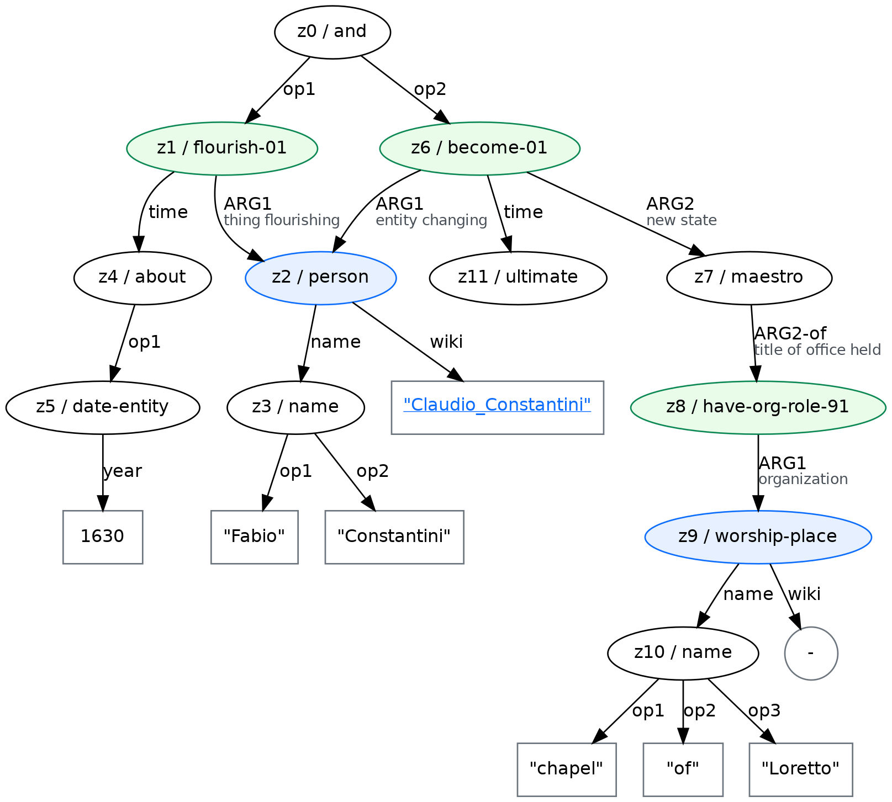

# Historical Named Entities Recognition, Classification and Linking

Named Entity Recognition and Classification (NERC) and Entity Linking (EL) are foundational tasks in knowledge extraction. NERC consists of extracting mentions of named entities (such as people, locations, organisations, etc.) in text and assigning them to a pre-defined set of entity types, such as `person`, `location` or `organisation`. EL consists of correlating named entities' mentions to the actual entity they refer to, choosing possible candidates from a reference Knowledge Base (KB), such as Wikipedia, DBPedia, Wikidata.

NERC and EL have become progressively more relevant for historical documents due to the massive campaigns of digitisation carried out in recent years. NERC and EL are particularly challenging on historical documents due to the noisy quality of the plain text derived through Optical Character Recognition (OCR) technologies. Also, non-contemporary language differs from nowadays' varieties in diverse lexical, morpho-syntactic and semantic aspects, such as spelling variation, sentence structure and naming conventions. Furthermore, annotated datasets of historical texts are scarce, and state-of-the-art (SotA) models, based on the supervised paradigm, are trained on contemporary data based mainly on web documents. Great research effort in this area has recently been carried out by [HIPE - Identifying Historical People, Places and Other Entities](https://hipe-eval.github.io/HIPE-2022/), a CLEF evaluation lab.

## Historical Entity Linking

EL is especially challenging when applied to historical text, especially when it involves entity disambiguation (linking named entities whose superficial mention is common to many named entities to their correct entry in a knowledge base). We hypothesise that the _popularity bias_ in state-of-the-art (SotA) neural entity linkers, a phenomenon investigated in [Evaluating Entity Disambiguation and the Role of Popularity in Retrieval-Based NLP](https://aclanthology.org/2021.acl-long.345/) (Chen et al., ACL-IJCNLP 2021), intensifies when applied to entities extrapolated from historical texts. Popularity bias causes popular entities, i.e. entities that are more frequent in a training set, to be preferred to less frequent entities, even if the context in which they appear is unambiguous. 

The cause of this heightened bias can be traced back to historical entities being less represented in popular training datasets. Furthermore, in the context of historical documents, this popularity bias tends to evolve into a peculiar bias, which we term as _temporal bias_. This is the tendency for these neural entity linkers to favour contemporary entities over historical entities, even if other unambiguous historical entities are mentioned in the same context. Eventually, they reach lower performance when applied to historical entities found in historical texts, as compared to the performance reached when applied to contemporary entities found in contemporary texts. 

For example, it is possible to appreciate this phenomenon in the AMR graph produced by the [Polifonia Knowledge Extractor (PKE)](https://github.com/polifonia-project/Polifonia-Knowledge-Extractor) from the sentence _"Fabio Constantini flourished about the year 1630, and ultimately became maestro at the chapel of Loretto."_, extrapolated from _The Quarterly Musical Magazine And Review_, n. 22 (1824), part of the _Periodicals_ module of the [PTC](https://github.com/polifonia-project/Polifonia-Corpus)., reported in the figure below:



In the AMR graph, the NEs recognition and classification (NERC) performed by [SPRING](https://github.com/SapienzaNLP/spring) correctly recognises the superficial named entity's mention _Fabio Constantini_, which is erroneously linked by [BLINK](https://github.com/facebookresearch/BLINK) to the Wikipedia page of [Claudio Constantini](https://en.wikipedia.org/wiki/Claudio_Constantini), a Peruvian composer born in 1983. The correct link should be to the Wikidata entity [Fabio Constantini](https://www.wikidata.org/wiki/Q3737659), with QID `Q3737659`, an Italian composer born in 1575.

## Contribution 

We aim to mitigate the need for gold-standard resources containing NERC- and EL-annotated historical documents by releasing a new model for historical entity linking and a new benchmark for the task. We release:
- [Musical Heritage Historical named Entities Recognition, Classification and Linking (MHERCL)](https://github.com/arianna-graciotti/historical-entity-linking/tree/main/benchmark) benchmark to enrich the landscape of gold-standard resources containing NERC- and EL-annotated historical documents;
- [Entity Linking Dynamics](https://github.com/arianna-graciotti/historical-entity-linking/tree/main/model), an innovative model for Entity Linking that grounds its inner entity disambiguation process to the context in which entities appear, relying on relaxation labelling processes. 

### High-level Repository Structure 
_(first to third level only)_

```
Polifonia-Corpus
│   README.md    
│
└───benchmark
│   │   README.md
│   │
│   └───IAA
│   │
│   └───preliminary_study
│   │
│   └───v0.1
│   
└───images
|
|___models
    |   README.md
    │
    └───images
    │
    └───src
    │
    └───vocabs
```
